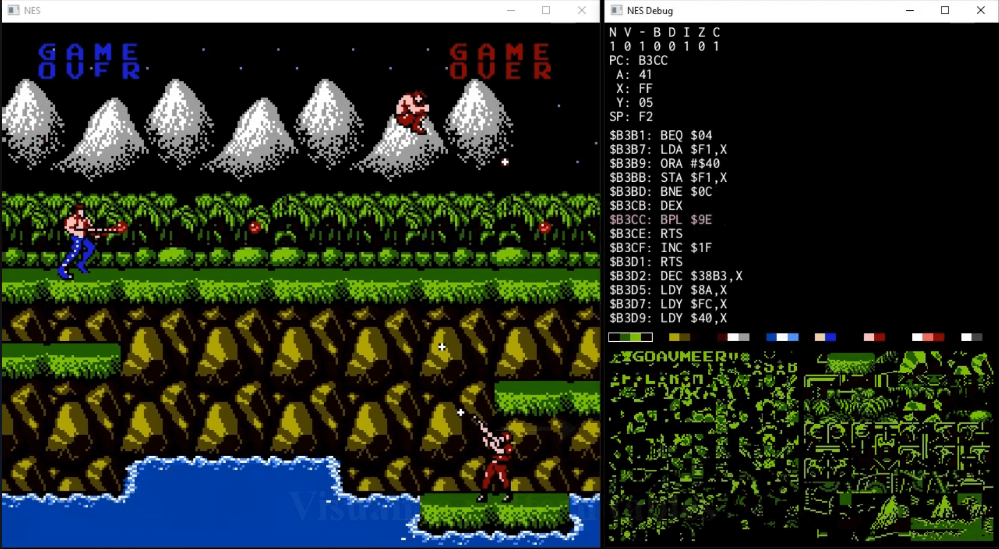

# NES Emulator
  

I grew up playing the NES so I really love this system. I learned most of what  
I know about the NES from the [nesdev wiki](https://www.nesdev.org/wiki/Nesdev_Wiki), the contributors who compiled that  
information are amazing. Special thanks to Disch [RIP] who wrote many answers  
in the nesdev forums to questions about the APU. They helped me immensely when  
trying to figure out audio, even so many years after he wrote them.  

# Linux
Install [SDL2](https://github.com/libsdl-org/SDL/releases/)  
Linux installation instructions [here](http://wiki.libsdl.org/Installation#linuxunix)  
**NOTE** You need at least version 2.0.18, because I use SDL_GetTicks64().
## Building
1. run `make`  
2. run `./nes <path_to_game_rom>`  

# Windows
The build.bat file will attempt to download SDL2 for you.  
  
**YOU ONLY NEED TO DO THE FOLLOWING IF THE build.bat SCRIPT FAILS FOR SOME REASON**  
1. Download the SDL2 developement libary for VC
	- All releases found [here](https://github.com/libsdl-org/SDL/releases/)  
	- Version 2.26.4 download: [SDL2-devel-2.26.4-VC.zip](https://github.com/libsdl-org/SDL/releases/download/release-2.26.4/SDL2-devel-2.26.4-VC.zip)  
2. Extract the contents and move them to a directory called SDL2 in the project root  
	(if you extract to a dir called unzipped, you will need to move unzipped/SDL2-2.26.4 to SDL2)   
## Building
1. Make sure you have access to the msvc compiler
	- This can be done by running  `vcvarsall.bat`, whose location will depend on  
	where you installed Visual Studio. An example from one of the machines I use is:  
	`"C:\Program Files\Microsoft Visual Studio\2022\Community\VC\Auxiliary\Build\vcvarsall.bat" x86_amd64`
1. run `build.bat`  
2. run `build\nes <path_to_game_rom>`   
  
#### References:
http://6502.org  
https://www.nesdev.org/wiki/Nesdev_Wiki  
https://masswerk.at/6502/6502_instruction_set.html  
http://www.6502.org/documents/books/mcs6500_family_hardware_manual.pdf  
http://www.6502.org/documents/books/mcs6500_family_programming_manual.pdf  
http://6502.org/tutorials/interrupts.html  
http://www.6502.org/tutorials/vflag.html  
http://www.righto.com/2012/12/the-6502-overflow-flag-explained.html  
https://bisqwit.iki.fi/jutut/kuvat/programming_examples/nesemu1/  
https://fms.komkon.org/EMUL8/NES.html#LABA  
https://www.copetti.org/writings/consoles/nes/  
https://www.romhacking.net/download/documents/362/  
https://www.youtube.com/watch?v=F8kx56OZQhg&list=PLrOv9FMX8xJHqMvSGB_9G9nZZ_4IgteYf&index=2   
https://nescartdb.com/  
**APU**  
https://www.nesdev.org/apu_ref.txt  
https://github.com/Grieverheart/sdl_tone_oscillator  
http://nicktasios.nl/posts/making-sounds-using-sdl-and-visualizing-them-on-a-simulated-oscilloscope.html  
https://forums.nesdev.org/viewtopic.php?f=3&t=13749  
https://forums.nesdev.org/viewtopic.php?f=3&t=13767  
https://www.reddit.com/r/EmuDev/comments/5gkwi5/gb_apu_sound_emulation/  

